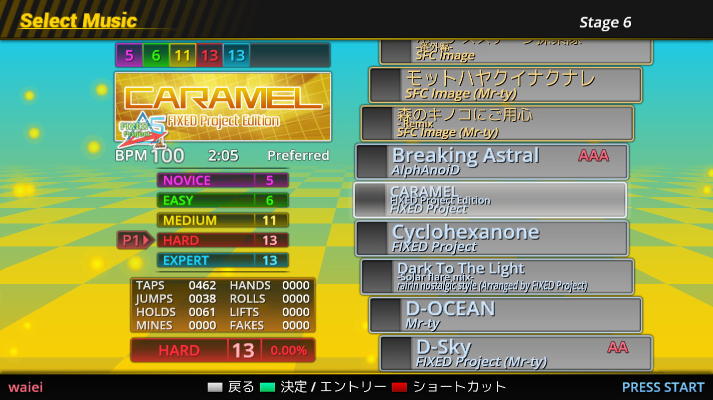
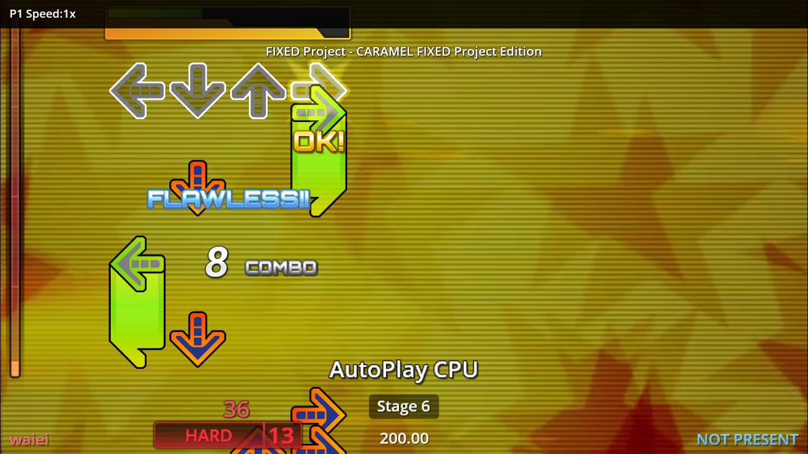
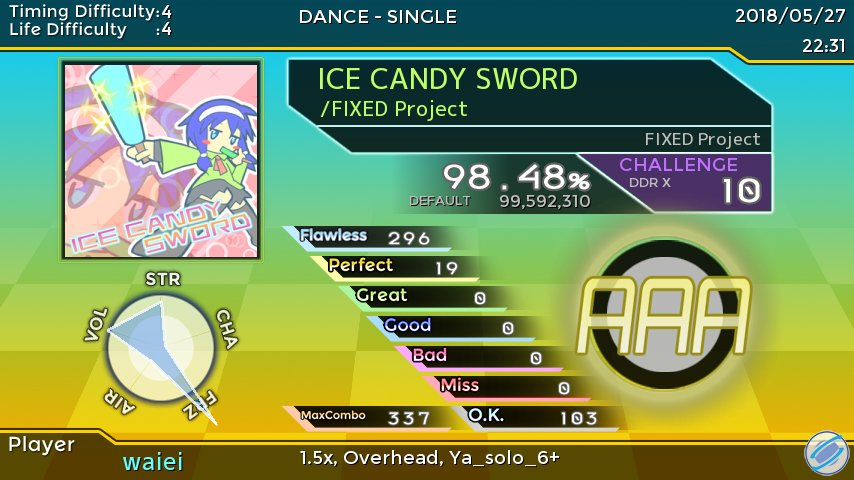

# サンプルテーマ Default Extended
StepMania5.0で動作するサンプルテーマです。（5.1Betaでは動作しません）

楽曲のソートや色分けに対応

ゲーム中にハイスピードとスクロール方向の変更が可能（Select + 矢印キー）

Twitter用のリザルト連携機能対応（リザルト画面で「↑」キー）

実装機能
- 楽曲カラー
- 楽曲ソート
- その他、Group.iniサポート
- Twitter連携（リザルト画面で「↑」キー）
- スコア計算式の変更（ただしUIは用意していません）
- ゲーム中のスクロール速度・方向の変更（Select + 矢印キー）

今後実装予定（現時点では未実装）
- EXFolder
- Drill